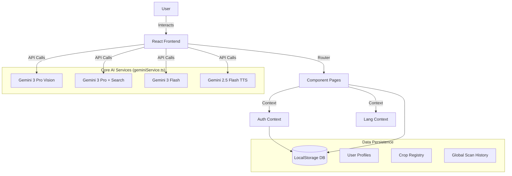

# 🧬 KrishiVigyan AI: Deep Technical Architecture

> **Document Type**: Technical Specification  
> **Version**: 2.4  
> **Status**: Implementation Guide

This document details the specific code-level logic and architectural patterns used in the KrishiVigyan AI platform. Use this as the primary reference for the **Technical Report** and **System Design** chapters.

---

## 🏗 System Architecture



---

## 1. The Core AI Service (`geminiService.ts`)

This module acts as the "Neural Backbone" of the application, abstracting complex AI interactions into callable functions.

### 👁️ Vision Logic: `analyzeCropImage`
*   **Model**: `gemini-3-pro-preview`
*   **Technique**: **Persona Injection**. The prompt forces the model to adopt the persona of a "Plant Pathologist," prioritizing scientific accuracy over conversational tone.
*   **Output Control**: Uses `responseSchema` to enforce valid JSON output, preventing "hallucinated" formats that could break the UI.

### 🔍 Search Grounding: `getMarketIntelligence`
*   **Model**: `gemini-3-pro-preview`
*   **Tool Use**: `googleSearch`
*   **Purpose**: Bypasses the LLM's knowledge cutoff. The model actively queries the live web for current APMC trade rates before synthesizing a response.

### 🗣️ Audio Logic: `speakText`
*   **Model**: `gemini-2.5-flash-preview-tts`
*   **Technical Feat**: **Raw PCM Decoding**.
    *   Standard browsers do not natively play Gemini's raw audio byte stream.
    *   **Implementation**: A custom `decodeAudioDataManual` function converts raw 16-bit integers into a standard Web Audio API `AudioBuffer`.

---

## 2. Localization Logic (`translations.ts`)

Unlike standard i18n libraries, this project uses a lightweight **Dual-Key Semantic Map**.

*   **Structure**:
    ```typescript
    export const translations = {
      en: { nav: { home: "Home", ... } },
      kn: { nav: { home: "ಮನೆ", ... } }
    }
    ```
*   **State Management**: The `useLang` context in `App.tsx` enables atomic state updates, allowing the entire application to switch languages instantly without a page reload.

---

## 3. Data Persistence (`App.tsx` & `Admin.tsx`)

The application implements a **Simulated Relational Database** using specific keys in `localStorage`.

| Database Key | Purpose | Relational Logic |
| :--- | :--- | :--- |
| `kv_user_db` | User Profiles | Primary Key: `id` |
| `kv_master_crops` | Crop Registry | Referenced by Tracker & Analysis |
| `kv_global_scans_db` | Scan History | Foreign Key: `userId` |
| `kv_feedback_db` | User Feedback | Linked to `diagnosisId` |

> **Note**: This architecture ensures that when an Admin adds a new crop in `Admin.tsx`, it immediately propagates to `Crops.tsx` (Library) and `Tracker.tsx` (Selection List) via the shared storage layer.

---

## 4. Navigation & Security (`App.tsx`)

### 🛡️ Role-Based Access Control (RBAC)
Security is handled via a `ProtectedRoute` wrapper component.

*   **Authentication**: Checks for valid session token in `kv_session`.
*   **Authorization**: 
    *   **User Route**: Accessible to any logged-in user.
    *   **Admin Route**: Strict check for `user.role === 'admin'`.
    *   **Root Admin**: Hardcoded privilege for `tharungowdapr@gmail.com` to prevent lockout.

---

## 5. UI/UX Philosophy

The interface is designed to be "Technical yet Organic."

*   **Color Palette**: **Nature-Stone**
    *   Primary: Deep Forest Green
    *   Base: Warm Stone/Paper
    *   Accent: Solar Yellow
*   **Typography**:
    *   *Headings*: **Space Grotesk** (Modern, Scientific)
    *   *Body*: **Inter** (Clean, Readable)
    *   *Accents*: **Playfair Display** (Organic, Traditional)
*   **Responsiveness**: Mobile-first grid architecture using Tailwind CSS, ensuring usability on low-cost devices in the field.

---

*Technical Specification v2.4*