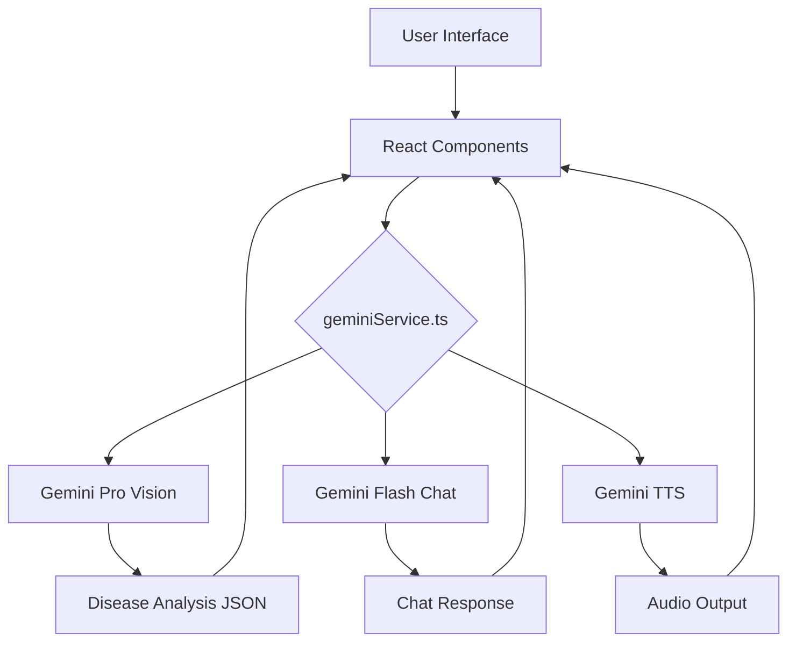

<


**A state-of-the-art agricultural intelligence platform engineered for Karnataka farmers**

[Features](#-features) • [Demo](#-demo) • [Installation](#-installation) • [Architecture](#-architecture) • [Tech Stack](#-tech-stack) • [API Reference](#-api-reference) • [Contributing](#-contributing)

</div>

---

## 🌟 Overview

**KrishiVigyan AI** is a comprehensive agricultural technology solution that combines cutting-edge AI capabilities with practical farming tools. Built specifically for the diverse farming landscape of Karnataka, India, it empowers farmers with:

- 🔬 **AI-Powered Disease Diagnosis** — Identify crop diseases with up to 98% accuracy
- 📊 **Real-Time Market Intelligence** — Live APMC trade rates and MSP data
- 💬 **Multilingual AI Assistant** — Natural conversations in English and Kannada (ಕನ್ನಡ)
- 🌱 **Personalized Crop Tracking** — Comprehensive field management system

---

## ✨ Features

### 1. 🔬 Biological Diagnostic Terminal (`/analysis`)
AI-powered crop disease detection and analysis system.

| Feature | Description |
|---------|-------------|
| **Neural Vision** | Uses `gemini-3-pro-preview` for high-precision pathogen identification |
| **Structured Output** | Returns disease name, confidence score, symptoms, causes, treatment & prevention |
| **Economic Impact** | Calculates yield loss percentage and financial impact per acre |
| **Multilingual Reports** | Diagnosis available in English and Kannada |

### 2. 🤖 Vani AI: Multilingual Chatbot (`/chat`)
Context-aware AI assistant for agricultural queries.

- **Multi-Modal Input** — Supports text, images, and voice
- **Conversation Memory** — Retains knowledge of scan history and crop lifecycle
- **Voice Synthesis** — Native voice output using Gemini TTS for accessibility
- **Expert Guidance** — Provides actionable farming advice based on context

### 3. 📈 Market Intelligence Hub (`/market`)
Real-time agricultural market data and forecasting.

- **Live Price Tracking** — Current APMC trade rates across Karnataka mandis
- **MSP Information** — Government Minimum Support Price updates
- **Trend Analysis** — Market sentiment (Uptrend/Stable/Correction)
- **Strategy Recommendations** — Data-driven buy/sell/hold advice

### 4. 🌾 Crop Knowledge Base (`/crops`)
Comprehensive database of South Indian crops with detailed lifecycle information.

- **Growth Stage Tracking** — From sowing to harvest
- **Disease Matrix** — Risk levels across different growth stages
- **Optimal Conditions** — Temperature, soil, water, and fertilizer requirements
- **Investment Calculator** — Estimated costs and profit projections

### 5. 📟 Acreage Tracker (`/tracker`)
Personal farm management dashboard.

- **Field Management** — Track multiple crop profiles
- **Growth Logging** — Record observations with photos
- **Health Monitoring** — Visual health status indicators
- **AI Recommendations** — Personalized weekly task suggestions

### 6. 🛡️ Admin Dashboard (`/admin`)
System administration and analytics (protected route).

- **User Management** — View and manage registered users
- **Crop Registry** — Add/edit/delete crop varieties
- **Global Analytics** — Platform-wide scan statistics
- **Feedback Management** — Review user feedback and ratings

---

## 🎯 Demo

### Screenshots

| Home | Disease Analysis | Market Intelligence |
|:----:|:----------------:|:-------------------:|
| Modern dashboard with quick access | Upload & analyze crop images | Real-time price data |

| Crop Tracker | AI Chat | Admin Panel |
|:------------:|:-------:|:-----------:|
| Manage your fields | Multi-modal assistant | System management |

---

## 🚀 Installation

### Prerequisites

- **Node.js** 18+ and npm
- **Python** 3.8+ (for Flask backend)
- **Google Gemini API Key**

### Quick Start

```bash
# 1. Clone the repository
git clone https://github.com/Tharungowdapr/AGRI-AI.git
cd AGRI-AI

# 2. Install frontend dependencies
npm install

# 3. Configure environment variables
# Create a .env.local file with your API key
echo "API_KEY=your_gemini_api_key_here" > .env.local

# 4. Start the development server
npm run dev
```

### Backend Setup (Optional)

```bash
# Install Python dependencies
pip install flask

# Run Flask server
python app.py
```

### Environment Variables

| Variable | Description | Required |
|----------|-------------|----------|
| `API_KEY` | Google Gemini API Key | ✅ Yes |

> **Note:** Obtain your API key from [Google AI Studio](https://aistudio.google.com/app/apikey)

---

## 🏗️ Architecture

```
krishivigyan-ai/
├── 📄 index.html          # Entry point
├── 📄 index.tsx           # React bootstrap
├── 📄 App.tsx             # Main application with routing & contexts
├── 📄 geminiService.ts    # AI service layer (Gemini API integration)
├── 📄 types.ts            # TypeScript type definitions
├── 📄 translations.ts     # Multilingual content (EN/KN)
├── 📄 constants.ts        # Crop data & application constants
│
├── 📁 pages/
│   ├── Home.tsx           # Landing page
│   ├── Analysis.tsx       # Disease detection module
│   ├── Chat.tsx           # AI chatbot interface
│   ├── Crops.tsx          # Crop knowledge base
│   ├── CropDetail.tsx     # Individual crop details
│   ├── Market.tsx         # Market intelligence
│   ├── Tracker.tsx        # Personal farm tracker
│   ├── History.tsx        # Scan history
│   ├── Settings.tsx       # User preferences
│   ├── Login.tsx          # Authentication
│   ├── Admin.tsx          # Admin dashboard
│   └── Enhancement.tsx    # Future roadmap
│
├── 📁 components/
│   └── FloatingChat.tsx   # Floating AI assistant widget
│
├── 📁 templates/          # Flask HTML templates
│   ├── layout.html
│   ├── home.html
│   └── ...
│
├── 📄 app.py              # Flask backend server
├── 📄 translations.py     # Python translations
├── 📄 package.json        # Node.js dependencies
├── 📄 vite.config.ts      # Vite configuration
└── 📄 tsconfig.json       # TypeScript configuration
```

### Data Flow



---

## 🛠️ Tech Stack

### Frontend
| Technology | Version | Purpose |
|------------|---------|---------|
| React | 19.2.3 | UI Framework |
| TypeScript | 5.8 | Type Safety |
| Vite | 6.2 | Build Tool |
| React Router | 7.1.1 | Navigation |
| Lucide React | 0.475.0 | Icons |
| Recharts | 2.12.7 | Data Visualization |
| React Markdown | 9.0.1 | Markdown Rendering |

### AI Services
| Model | Use Case |
|-------|----------|
| `gemini-3-pro-preview` | Complex analysis, image diagnosis, market search |
| `gemini-3-flash-preview` | Fast multi-modal chat |
| `gemini-2.5-flash-preview-tts` | Text-to-speech synthesis |

### Backend
| Technology | Purpose |
|------------|---------|
| Flask | Python web framework |
| Session Management | Language preferences |

---

## 📚 API Reference

### `analyzeCropImage(base64Image, language)`
Analyzes crop images for disease detection.

**Returns:**
```typescript
{
  diseaseName: string;
  confidence: number;        // 0-1
  symptoms: string[];
  causes: string[];
  treatment: string[];
  prevention: string[];
  yieldLossPercentage: string;
  economicImpact: string;
}
```

### `getMarketIntelligence(cropName, language)`
Fetches real-time market data using Google Search grounding.

### `sendMultiModalMessage(history, text, image?, audio?)`
Sends multi-modal messages to the AI chatbot.

### `speakText(text)`
Converts text to speech using Gemini TTS.

---

## 🌐 Localization

The platform supports complete bilingual operation:

| Language | Code | Coverage |
|----------|------|----------|
| English | `en` | 100% |
| Kannada | `kn` | 100% |

Language switching is instant and preserves application state.

---

## 🔐 Authentication & Security

- **Role-Based Access Control (RBAC)** — User and Admin roles
- **Protected Routes** — Admin dashboard and personal tracker require authentication
- **Local Storage** — Session persistence with `kv_session` and `kv_user_db`
- **Root Admin** — Configurable super-admin with full system access

---

## 📊 Data Persistence

The application uses a simulated relational database through localStorage:

| Store Key | Purpose |
|-----------|---------|
| `kv_user_db` | User accounts and preferences |
| `kv_session` | Active session data |
| `kv_master_crops` | Crop registry (admin-editable) |
| `kv_global_scans_db` | Platform-wide scan history |
| `kv_feedback_db` | User feedback and ratings |

---

## 🎨 Design Philosophy

- **Nature-Stone Palette** — Harmonious greens, warm stones, and accent yellows
- **Typography** — Space Grotesk (technical) + Playfair Display (organic)
- **Mobile-First** — Fully responsive design for field usage
- **Accessibility** — Voice synthesis and high-contrast elements

---

## 📈 Future Roadmap

- [ ] Weather API Integration
- [ ] IoT Sensor Support
- [ ] Offline Mode with PWA
- [ ] Advanced Analytics Dashboard
- [ ] Community Forum
- [ ] Expert Consultation Booking

---

## 🤝 Contributing

Contributions are welcome! Please follow these steps:

1. Fork the repository
2. Create a feature branch (`git checkout -b feature/amazing-feature`)
3. Commit your changes (`git commit -m 'Add amazing feature'`)
4. Push to the branch (`git push origin feature/amazing-feature`)
5. Open a Pull Request

---

## 📄 License

This project is developed for educational purposes.

---

## 👨‍💻 Author

**Tharun Gowda PR**

- GitHub: [@Tharungowdapr](https://github.com/Tharungowdapr)
- Email: tharungowdapr@gmail.com

---

<div align="center">

**Built with ❤️ for Karnataka Farmers**

🌱 *Empowering Agriculture with AI* 🌱

</div>
]]>
