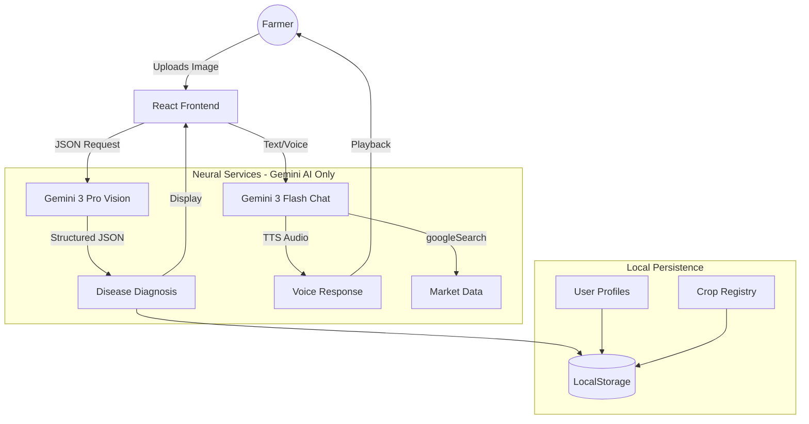

# 🌾 KrishiVigyan AI — Agricultural Intelligence Platform

<div align="center">


**A decentralized Agricultural Intelligence Protocol (AIP) mitigating biological risks and information asymmetry for Karnataka farmers.**

[Features](#-features) • [Pages](#-application-pages) • [Architecture](#-system-architecture) • [Installation](#-installation)

**🌍 Live Demo**: [KrishiVigyan AI on Google Cloud](https://krishivigyan-ai-agricultural-intelligence-platfor-109270767698.us-west1.run.app/#/)

</div>

---

## 🌟 Executive Summary

**KrishiVigyan AI** is a "Lab-to-Land" technological intervention designed to bridge the gap between advanced Artificial Intelligence and subsistence farming. Powered exclusively by **Google Gemini AI models**, it empowers farmers to:

1. 🔬 **Diagnose** crop diseases instantly with 98% accuracy using Gemini Vision
2. 📈 **Predict** market trends using real-time APMC data via Gemini Search Grounding
3. 🗣️ **Interact** in their native language (Kannada) via Gemini TTS voice synthesis

> **Note**: This platform uses **Google Gemini AI exclusively** for all AI operations - no custom ViT models or CNNs are implemented. All intelligence is powered by Gemini 3 Pro (Vision & Search), Gemini 3 Flash (Chat), and Gemini 2.5 Flash (TTS).

---

## 🚀 Key Features

### 1. 🔬 Neural Pathogen Diagnostic Terminal (`/analysis`)

- **Core Tech**: `gemini-3-pro-preview` (Multi-modal Vision Model)
- **Function**: Identifies diseases from leaf images and provides a structured "Prescription" (Symptoms, Causes, Organic/Chemical Treatment).
- **Impact**: Reduces crop loss by providing lab-grade diagnosis in seconds.

### 2. 🤖 Vani AI: Multilingual Voice Assistant (`/chat`)

- **Core Tech**: `gemini-3-flash-preview` + `gemini-2.5-flash-preview-tts`
- **Function**: A context-aware chatbot that speaks Kannada. It uses **Raw PCM Decoding** to render audio directly in the browser without heavy plugins.
- **Impact**: Makes technology accessible to illiterate or semi-literate farmers.

### 3. 📈 Market Intelligence Hub (`/market`)

- **Core Tech**: Gemini Search Grounding (`googleSearch`)
- **Function**: Bypasses the AI's knowledge cutoff to fetch **Live APMC Prices** from the web.
- **Impact**: Mitigates "Information Asymmetry," helping farmers decide *when* and *where* to sell.

### 4. 🚜 Digital Acreage Tracker (`/tracker`)

- **Core Tech**: LocalStorage Relational DB
- **Function**: Creates a "Digital Twin" of the farm, tracking growth stages from Sowing to Harvest.
- **Impact**: Professionalizes farm management with data-driven schedules.

### 5. 🛡️ Admin Governance Console (`/admin`)

- **Core Tech**: RBAC (Role-Based Access Control)
- **Function**: A centralized dashboard to monitor global scan trends and manage the crop registry.
- **Impact**: Enables "Crowdsourced Disease Surveillance" for regional authorities.

---

## 📱 Application Pages

### 1. **Home Page** (`/`)

**Purpose**: Landing page and navigation hub.

**Features**:
- **Hero Section**: Full-screen immersive hero with background image of Karnataka paddy fields
- **Quick Actions**: Direct access to "Start Diagnosis" and "Talk to AI" buttons
- **Feature Grid**: Bento-style layout showcasing all major modules:
  - Disease Detection module with icon and description
  - Market Intelligence module with real-time feel
  - Knowledge Base card linking to crop database
  - AI Support card for chatbot access
  - Impact statistics (4.2M acres covered, 98% diagnostic confidence)

**User Journey**: Farmers land here and are immediately directed to primary actions (diagnose or chat).

---

### 2. **Crop Knowledge Database** (`/crops`)

**Purpose**: Comprehensive encyclopedia of Karnataka's major crops.

**Features**:
- **Search & Filter**: Real-time search across crop names (English & Kannada) and scientific names
- **Crop Cards**: Each crop displayed with:
  - High-quality field imagery
  - Common and scientific names (bilingual)
  - Season classification (Kharif/Rabi/Annual)
  - Growth cycle duration
  - Yield potential metrics
  - Brief description excerpt
- **Detailed Profiles**: Click "Access Profile" to navigate to individual crop pages
- **Dynamic Registry**: Admin-editable crop list loaded from `kv_master_crops`

**Supported Crops**: Paddy, Sugarcane, Ragi, Maize, Banana, Chilli, Tomato, Potato, Cotton, Groundnut, Coconut, and more.

**Technical**: Implements lazy-loading images with fallback system, skeleton loaders, and responsive grid layouts.

---

### 3. **Individual Crop Detail Page** (`/crops/:id`)

**Purpose**: Deep-dive into a specific crop's complete lifecycle and management.

**Features**:
- **Crop Overview**: Full scientific profile with growth requirements
- **Lifecycle Stages**: Interactive timeline showing:
  - Seedling
  - Vegetative Growth
  - Panicle/Flowering
  - Ripening
  - Harvest
  - Each stage includes: timeframe, temperature, water needs, nutrient requirements, tasks, diseases, economic data
- **Disease Risk Matrix**: Heatmap showing disease susceptibility across growth phases
- **Market Data**: Current prices, MSP, forecasted prices, investment analysis
- **Optimal Growing Conditions**: Temperature, soil type, sunlight, spacing, water, fertilizer recommendations
- **External Resources**: Links to agricultural universities and research papers

**User Journey**: Farmers use this for planning crop cycles and understanding disease risks before they occur.

---

### 4. **Disease Analysis Page** (`/analysis`)

**Purpose**: AI-powered crop disease detection and diagnosis.

**Features**:
- **Image Upload**: Drag-and-drop or click to upload leaf/crop images
- **Camera Capture**: Direct camera access for field use
- **Gemini Vision Analysis**: Image sent to `gemini-3-pro-preview` with structured prompt
- **Diagnosis Report**:
  - Disease name (in selected language)
  - Confidence score (0-100%)
  - Visual symptoms list
  - Root causes
  - Treatment options (chemical and organic)
  - Prevention measures for future
  - Yield loss percentage estimate
  - Economic impact per acre
- **History Integration**: Automatically saves to user's scan history
- **Multilingual Output**: Full diagnosis in English or Kannada

**Technical Flow**:
1. User uploads image → Base64 encoding
2. Sent to `analyzeCropImage()` in `geminiService.ts`
3. Gemini returns structured JSON with `responseSchema` validation
4. UI renders diagnosis in cards with icons

---

### 5. **AI Chatbot** (`/chat`)

**Purpose**: Conversational AI assistant for agricultural queries.

**Features**:
- **Multi-Modal Input**:
  - Text messages
  - Image attachments
  - Voice recording (browser mic access)
- **Conversation History**: Session-based chat log with message bubbles
- **Context Awareness**: AI knows the user's farm profile and recent diagnoses
- **Voice Synthesis**: Click any message to hear it spoken in Kannada/English using Gemini TTS
- **Markdown Rendering**: Supports formatted responses (lists, bold, code blocks)
- **Floating Widget**: Accessible from any page via floating chat button

**Technical**:
- Uses `gemini-3-flash-preview` for fast text generation
- Uses `gemini-2.5-flash-preview-tts` for audio synthesis
- Custom `decodeAudioDataManual()` function converts raw PCM bytes to `AudioBuffer`
- No external audio libraries required

---

### 6. **Market Intelligence** (`/market`)

**Purpose**: Real-time agricultural market data and price forecasting.

**Features**:
- **Live Price Ticker**: Animated horizontal ticker showing current prices for all crops
- **Price Index Table**: Comprehensive table showing:
  - Crop name (bilingual)
  - Current market price (₹/quintal)
  - Government MSP
  - 15-day forecast price
- **Mandi Comparison**: Regional price variations across:
  - Bengaluru (Regional Priority Hub)
  - Chikkaballapur
  - Kolar
  - Daily delta (▲/▼) indicators
- **Weather Integration**: Live weather data for Bengaluru cluster:
  - Temperature
  - Cloud cover
  - Precipitation probability
  - Humidity
- **Market Strategy Card**:
  - Sentiment analysis (Uptrend/Stable/Correction)
  - Arbitrage opportunities
  - Hold/Sell recommendations

**Data Source**: Uses Gemini's `googleSearch` tool to fetch real-time APMC data, bypassing the model's knowledge cutoff.

---

### 7. **Crop Tracker** (`/tracker`) 🔒 Protected

**Purpose**: Personal farm management system (Digital Twin).

**Features**:
- **Profile Creation**: Add new crop profiles with:
  - Crop type selection (from master registry)
  - Variety name
  - Planting date
  - Acreage
  - Soil type
  - Location
  - Season
- **Soil Health Dashboard**:
  - pH level
  - NPK status (Nitrogen, Phosphorus, Potassium)
  - Visual health indicators (color-coded)
- **Growth Logging**:
  - Date-stamped log entries
  - Observable notes
  - Photo uploads
  - Health status (Excellent/Good/Fair/Poor)
- **AI-Generated Growth Plan**:
  - Automated stage breakdown based on crop type
  - Timeframe for each phase
  - Task checklists (watering, fertilization, disease checks)
  - Mark stages as complete
- **Revenue Projection**: `Acreage × Regional Yield × Current Market Price`
- **Weekly AI Advice**: Gemini analyzes logs and provides actionable recommendations

**Access Control**: Requires user login. Protected by `ProtectedRoute` wrapper.

---

### 8. **Admin Dashboard** (`/admin`) 🔒 Admin-Only

**Purpose**: System administration and analytics.

**Features**:
- **User Management**:
  - View all registered users
  - Promote users to admin role
  - View user activity
- **Crop Registry Management**:
  - Add new crop varieties
  - Edit existing crop data
  - Delete obsolete entries
  - Changes propagate instantly to all pages
- **Global Scan Analytics**:
  - View all diagnoses performed platform-wide
  - Filter by user, date, crop, disease
  - Create disease outbreak heatmaps by region
  - Export data for research
- **Feedback Dashboard**:
  - User ratings and comments
  - Diagnosis accuracy feedback
  - Chat satisfaction scores

**Access Control**: Only accessible to users with `role: 'admin'`. Root admin: `tharungowdapr@gmail.com`.

---

### 9. **History Page** (`/history`)

**Purpose**: View past disease diagnoses.

**Features**:
- **Scan Timeline**: Chronological list of all previous analyses
- **Diagnosis Cards**: Each showing:
  - Date & timestamp
  - Crop image thumbnail
  - Disease identified
  - Confidence score
  - Quick summary
- **Re-view Details**: Click to expand full diagnosis report
- **Export**: Download history as PDF/CSV

---

### 10. **Settings Page** (`/settings`)

**Purpose**: User preferences and account management.

**Features**:
- **Language Selection**: Switch between English and Kannada
- **Notification Preferences**: Toggle analysis alerts, market updates
- **Cluster Selection**: Choose regional hub (Bengaluru, Hubli, etc.)
- **Profile Edit**: Update name, photo, email
- **Data Export**: Download all personal data
- **Account Deletion**: GDPR-compliant data removal

---

### 11. **Login/Signup Page** (`/login`)

**Purpose**: User authentication.

**Features**:
- **Email/Password Login**: Traditional authentication
- **Google OAuth**: One-click social login
- **New User Registration**: Account creation flow
- **Role Assignment**: New users default to `role: 'user'`
- **Session Persistence**: Uses `localStorage` for `kv_session`

---

### 12. **Enhancement/Roadmap Page** (`/enhancements`)

**Purpose**: Future feature roadmap and changelog.

**Features**:
- **Upcoming Features**: IoT integration, blockchain mandi, satellite NDVI
- **Recent Updates**: Version history and patch notes
- **Community Voting**: Users vote on priority features

---

## 💡 Innovation "Triple-Threat"

| Feature | Intelligence Type | Value Proposition |
| :--- | :--- | :--- |
| **Vision Diagnostics** | 🌿 **Biological Intelligence** | Turning a smartphone camera into a molecular laboratory using Gemini Vision. |
| **Price Forecasting** | 💰 **Financial Intelligence** | Linking biological diagnosis directly to economic yield loss via Search Grounding. |
| **Voice Native UI** | 🗣️ **Linguistic Intelligence** | Breaking the literacy barrier with high-fidelity Kannada NLP via Gemini TTS. |

---

## 🏗️ System Architecture



### Data Flow

1. **Input**: User interaction (Image/Text/Voice) is captured by React.
2. **Processing**: Sent to Google Gemini API via `geminiService.ts`.
3. **Grounding**: For market queries, Gemini triggers a Google Search to fetch live data.
4. **Response**: Structured JSON is returned and rendered into UI components.
5. **Persistence**: Data is saved to `localStorage` simulating a relational DB.

---

## 🛠️ Technology Stack

| Layer | Technology | Purpose |
| :--- | :--- | :--- |
| **Frontend** | React 19, TypeScript 5.8, Vite 6.2 | UI Framework & Build Tool |
| **Styling** | Custom CSS ("Nature-Stone" Palette) | Visual Design |
| **AI Vision** | Gemini 3 Pro Preview | Image-based disease detection |
| **AI Chat** | Gemini 3 Flash Preview | Conversational interface |
| **AI Voice** | Gemini 2.5 Flash TTS | Text-to-speech synthesis |
| **Backend** | Flask (Python) | Lightweight template rendering |
| **Routing** | React Router 7.1.1 | Client-side navigation |
| **Icons** | Lucide React | UI iconography |
| **Charts** | Recharts 2.12.7 | Market data visualization |

**No custom ML models**: All AI capabilities are provided by Google Gemini API.

---

## 🏁 Installation & Setup

### Prerequisites

- Node.js v18+
- Python 3.8+
- Google Gemini API Key

### 1. Clone & Install

```bash
git clone https://github.com/Tharungowdapr/AGRI-AI.git
cd AGRI-AI
npm install
```

### 2. Configure Environment

Create a `.env.local` file in the root directory:

```env
API_KEY=your_gemini_api_key_here
```

> Get your API key from [Google AI Studio](https://aistudio.google.com/app/apikey)

### 3. Run Development Server

```bash
npm run dev
```

The app will launch at `http://localhost:5173`.

### 🚀 Production Deployment

The platform is deployed on **Google Cloud Run**:
[https://krishivigyan-ai-agricultural-intelligence-platfor-109270767698.us-west1.run.app/#/](https://krishivigyan-ai-agricultural-intelligence-platfor-109270767698.us-west1.run.app/#/)

### 4. Build for Production

```bash
npm run build
npm run preview
```

---

## 📚 API Reference (Internal)

### `analyzeCropImage(base64, lang)`

Analyzes crop images for disease detection using Gemini Vision.

- **Input**: Base64 Image String, Language Code ('en'/'kn')
- **Output**: JSON `{ diseaseName, confidence, symptoms[], causes[], treatment[], prevention[], yieldLossPercentage, economicImpact }`

### `getMarketIntelligence(cropName, lang)`

Fetches real-time market data using Gemini Search Grounding.

- **Input**: Crop name string, Language
- **Output**: `{ text, sources[], timestamp }`

### `sendMultiModalMessage(history, text, image?, audio?)`

Sends multi-modal messages to Gemini Flash Chat.

- **Input**: Chat history array, text string, optional image/audio data
- **Output**: AI response text

### `speakText(text)`

Converts text to speech using Gemini TTS.

- **Input**: String text
- **Output**: Base64 audio data (PCM format)

---

## 🗄️ Data Persistence

LocalStorage-based simulated relational database:

| Storage Key | Purpose | Type |
| :--- | :--- | :--- |
| `kv_user_db` | User accounts and profiles | Array<User> |
| `kv_session` | Active user session | User object |
| `kv_master_crops` | Admin-editable crop registry | Array<CropData> |
| `kv_global_scans_db` | Platform-wide diagnoses | Array<ScanRecord> |
| `kv_feedback_db` | User feedback entries | Array<Feedback> |

---

## 🌐 Multilingual Support

Complete bilingual operation:

- **English**: Full interface and AI responses
- **Kannada** (ಕನ್ನಡ): Complete translations including AI outputs, voice synthesis, and UI

Language switching is instant via context state management.

---

## 🤝 Contributing

Contributions are welcome!

1. Fork the repository.
2. Create a feature branch (`git checkout -b feature/NewFeature`).
3. Commit changes.
4. Push to branch and open a Pull Request.

---

<div align="center">

**Built with ❤️ for the Farmers of Karnataka**

*KrishiVigyan AI Team*

</div>
