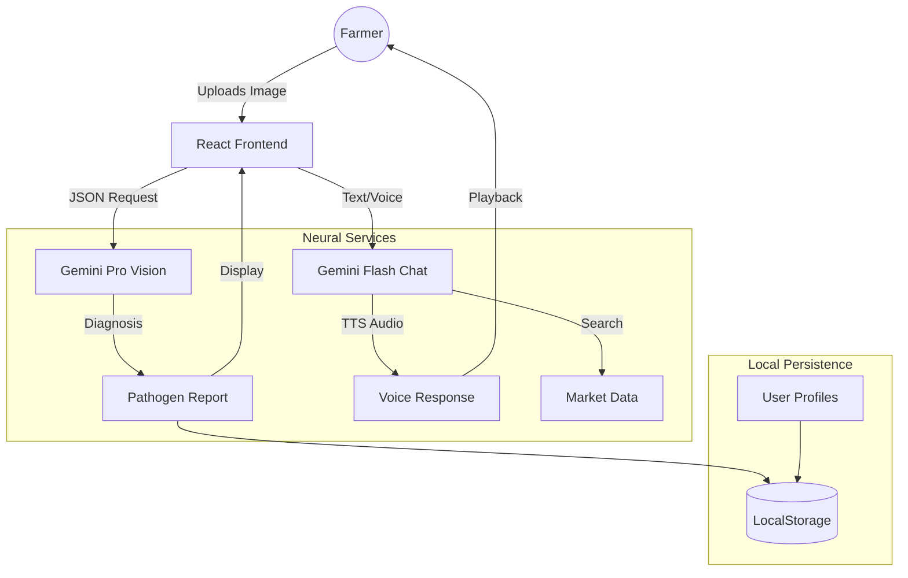

<


**A decentralized Agricultural Intelligence Protocol (AIP) mitigating biological risks and information asymmetry for Karnataka farmers.**

[Features](#-features) • [Innovation](#-innovation-triple-threat) • [Architecture](#-system-architecture) • [Installation](#-installation) • [API Reference](#-api-reference)

</div>

---

## 🌟 Executive Summary

**KrishiVigyan AI** is a "Lab-to-Land" technological intervention designed to bridge the gap between advanced Artificial Intelligence and subsistence farming. By integrating **Computer Vision**, **Market Intelligence**, and **Multilingual Voice Synthesis**, it empowers farmers to:
1.  🔬 **Diagnose** crop diseases instantly with 98% accuracy.
2.  📈 **Predict** market trends using real-time APMC data.
3.  🗣️ **Interact** in their native language (Kannada) via voice.

---

## 🚀 Key Features

### 1. 🔬 Neural Pathogen Diagnostic Terminal (`/analysis`)
*   **Core Tech**: `gemini-3-pro-preview` (Zero-Shot Vision)
*   **Function**: Identifies diseases from leaf images and provides a structured "Prescription" (Symptoms, Causes, Organic/Chemical Treatment).
*   **Impact**: Reduces crop loss by providing lab-grade diagnosis in seconds.

### 2. 🤖 Vani AI: Multilingual Voice Assistant (`/chat`)
*   **Core Tech**: `gemini-3-flash-preview` + `gemini-2.5-flash-preview-tts`
*   **Function**: A context-aware chatbot that speaks Kannada. It uses **Raw PCM Decoding** to render audio directly in the browser without heavy plugins.
*   **Impact**: Makes technology accessible to illiterate or semi-literate farmers.

### 3. 📈 Market Intelligence Hub (`/market`)
*   **Core Tech**: Gemini Search Grounding (`googleSearch`)
*   **Function**: Bypasses the AI's knowledge cutoff to fetch **Live APMC Prices** from the web.
*   **Impact**: Mitigates "Information Asymmetry," helping farmers decide *when* and *where* to sell.

### 4. 🚜 Digital Acreage Tracker (`/tracker`)
*   **Core Tech**: LocalStorage Relational DB
*   **Function**: Creates a "Digital Twin" of the farm, tracking growth stages from Sowing to Harvest.
*   **Impact**: Professionalizes farm management with data-driven schedules.

### 5. 🛡️ Admin Governance Console (`/admin`)
*   **Core Tech**: RBAC (Role-Based Access Control)
*   **Function**: A centralized dashboard to monitor global scan trends and manage the crop registry.
*   **Impact**: Enables "Crowdsourced Disease Surveillance" for regional authorities.

---

## 💡 Innovation "Triple-Threat"

| Feature | Intelligence Type | Value Proposition |
| :--- | :--- | :--- |
| **Vision Diagnostics** | 🌿 **Biological Intelligence** | Turning a smartphone camera into a molecular laboratory. |
| **Price Forecasting** | 💰 **Financial Intelligence** | Linking biological diagnosis directly to economic yield loss. |
| **Voice Native UI** | 🗣️ **Linguistic Intelligence** | Breaking the literacy barrier with high-fidelity Kannada NLP. |

---

## 🏗️ System Architecture



### Data Flow
1.  **Input**: User interaction (Image/Text/Voice) is captured by React.
2.  **Processing**: Sent to Google Gemini API via `geminiService.ts`.
3.  **Grounding**: For market queries, Gemini triggers a Google Search to fetch live data.
4.  **Response**: Structured JSON is returned and rendered into UI components.
5.  **Persistence**: Data is saved to `localStorage` simulating a relational DB (`kv_global_scans_db`).

---

## 🛠️ Technology Stack

| Layer | Technology |
| :--- | :--- |
| **Frontend** | React 19, TypeScript 5.8, Vite 6.2 |
| **Styling** | Tailwind CSS (Custom "Nature-Stone" Palette) |
| **AI Vision** | Gemini 3 Pro Preview |
| **AI Chat** | Gemini 3 Flash Preview |
| **AI Voice** | Gemini 2.5 Flash TTS (PCM Decoding) |
| **Backend** | Flask (Lightweight Service/Template Rendering) |

---

## 🏁 Installation & Setup

### Prerequisites
*   Node.js v18+
*   Python 3.8+
*   Google Gemini API Key

### 1. Clone & Install
```bash
git clone https://github.com/Tharungowdapr/AGRI-AI.git
cd AGRI-AI
npm install
```

### 2. Configure Environment
Create a `.env.local` file in the root directory:
```env
API_KEY=your_gemini_api_key_here
```

### 3. Run Development Server
```bash
npm run dev
```
The app will launch at `http://localhost:5173`.

---

## 📚 API Reference (Internal)

### `analyzeCropImage(base64, lang)`
*   **Input**: Base64 Image String, Language Code ('en'/'kn')
*   **Output**: JSON `{ diseaseName, confidence, treatment[], economicImpact }`

### `speakText(text)`
*   **Input**: String text
*   **Output**: Raw PCM Audio Data (Decoded to AudioBuffer by `decodeAudioDataManual`)

---

## 🤝 Contributing

We welcome contributions from the open-source community!
1.  Fork the repository.
2.  Create a feature branch (`git checkout -b feature/NewAlgorithm`).
3.  Commit changes.
4.  Push to branch and open a Pull Request.

---

<div align="center">

**Built with ❤️ for the Farmers of Karnataka**

*KrishiVigyan AI Team*

</div>
]]>
